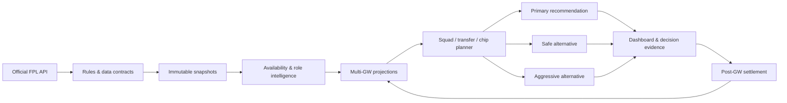
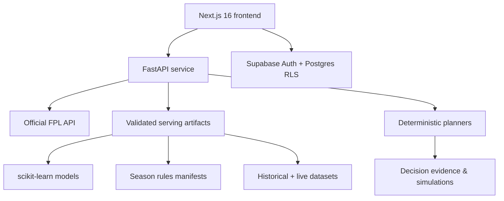

<p align="center">
  
</p>

<h1 align="center">SquadMetric</h1>

<p align="center">
  <strong>Recommendation-first Fantasy Premier League intelligence for the live 2026/27 season.</strong>
</p>

<p align="center">
  One primary recommendation, safer and aggressive alternatives, and the evidence needed to make the final call.
</p>

<p align="center">
  <a href="https://github.com/Moustafa-Ameen/squadmetric/actions/workflows/quality.yml"></a>
  
  
  
  
  
</p>

<p align="center">
  <a href="#why-squadmetric">Why SquadMetric</a> ·
  <a href="#features">Features</a> ·
  <a href="#how-it-works">How it works</a> ·
  <a href="#quick-start">Quick start</a> ·
  <a href="#historical-simulation">Simulation</a> ·
  <a href="#quality-and-safety">Quality</a>
</p>

> [!IMPORTANT]
> SquadMetric is **top-1%-oriented**, not a top-1% guarantee. It recommends transfers, captaincy, bench order, and chips, but it never logs into FPL or executes an action automatically.

## Why SquadMetric

Most FPL tools begin with tables. SquadMetric begins with the decision.

| The question | What SquadMetric returns |
|---|---|
| Who should I captain? | A primary captain, vice-captain, start probability, expected points, and alternatives |
| Should I transfer now? | Full-squad impact, hit cost, bank/free-transfer state, and the value of waiting |
| When should I use a chip? | Rule-legal chip branches, immediate gain, horizon gain, and future opportunity cost |
| Who starts and who is benched? | A legal XI, formation, ordered autosub bench, and Bench Boost-aware valuation |
| Can I trust the recommendation? | Rules/data hashes, point-in-time cutoffs, uncertainty, persisted evidence, and historical tests |

The default objective is simple:

```text
maximize realistic expected FPL points
- transfer hits
- downside and uncertainty
- future opportunity cost
+ squad flexibility
```

Rank-relative play remains an explicit, optional review mode. It never silently replaces points maximization.

## Features

### Decision engine

- Multi-Gameweek player projections with appearance and availability adjustment.
- Deterministic 15-player squad, XI, bench-order, captain, and vice-captain selection.
- Transfer planning with free-transfer banking, sale price, bank, and optional `-4` hits.
- Chip-aware state for Wildcard, Free Hit, Bench Boost, and Triple Captain.
- Blank and Double Gameweek fixture scenarios without hard-coded chip targets.
- Safe, balanced, and maximum-points alternatives.
- Penalty, direct-free-kick, and corner-role transition intelligence.

### Live 2026/27 intelligence

- Official FPL player IDs, teams, positions, prices, ownership, status, and availability.
- Instant onboarding for newly added players without blocking the website.
- Live fixture changes and postponements applied when a page refreshes.
- Rule-versioned eight-chip inventory with the GW19 half-season reset.
- Separate 2026/27 BPS and defensive-contribution regimes.
- Next-deadline targeting even while the current Gameweek is in progress.
- Projection caching that reacts to actionable changes but ignores live score/BPS noise.

### Product experience

- Professional recommendation-first dashboard.
- Visual pitch for the current squad and recommended XI.
- Weekly transfer, captaincy, bench, chip, player, and fixture pages.
- Email/password and Google authentication through Supabase.
- Owner-isolated profiles, FPL team links, preferences, drafts, and decision history.
- Responsive desktop/mobile interface with graceful live-data fallbacks.

### Evidence and operations

- Immutable official-data snapshots and SHA-256 hashes.
- Rules, model, fixture, and data-cutoff contracts.
- Point-in-time-safe historical simulation across multiple rule eras.
- Persisted pre-deadline decisions and post-Gameweek settlement.
- No-chip controls, counterfactual branches, and acceptance gates.
- Automated Python, TypeScript, lint, build, accessibility, desktop, and mobile checks.

## How it works



The system improves during the season through a guarded feedback loop:

1. Official prices, status, roles, and fixtures are read live.
2. Finalized Gameweeks are ingested only after FPL marks them finished and data-checked.
3. New training rows preserve the original pre-deadline market snapshot.
4. Models and decision policies are re-evaluated against fixed controls.
5. A candidate is promoted only when decision metrics pass—not because MAE looks better.

## Architecture



| Layer | Technology | Responsibility |
|---|---|---|
| Web | Next.js 16, React 19, TypeScript, Tailwind CSS | Accounts, dashboard, team, planner, players, fixtures, proof |
| API | FastAPI, Pydantic, httpx | Live FPL access, readiness, projections, recommendations |
| Intelligence | pandas, NumPy, scikit-learn, SciPy | Features, projections, calibration, deterministic optimization |
| Identity/data | Supabase Auth, PostgreSQL, RLS | Secure user accounts and owner-only saved data |
| Validation | pytest, Ruff, ESLint, Playwright, axe | Correctness, leakage protection, accessibility, responsive flows |

## Quick start

### Prerequisites

- Windows PowerShell (the maintained production/development path).
- Python 3.13.
- Node.js 24 and npm.
- A Supabase project for real account authentication.

### 1. Install

```powershell
git clone https://github.com/Moustafa-Ameen/squadmetric.git
cd squadmetric

py -3.13 -m venv .venv
.\.venv\Scripts\python.exe -m pip install -e ".[dev]"

cd frontend
npm.cmd install
cd ..
```

### 2. Configure

The API defaults work locally. Copy values from `.env.example` if you need to override hosts, ports, season, or readiness limits.

For authentication, apply the migration and configure Supabase as described in [supabase/README.md](supabase/README.md). Then create `frontend/.env.local`:

```dotenv
NEXT_PUBLIC_SUPABASE_URL=https://YOUR_PROJECT.supabase.co
NEXT_PUBLIC_SUPABASE_PUBLISHABLE_KEY=YOUR_PUBLISHABLE_KEY
SUPABASE_SECRET_KEY=YOUR_SERVER_ONLY_SECRET_KEY
```

> [!CAUTION]
> Never prefix the Supabase secret key with `NEXT_PUBLIC_`, expose it in the browser, or commit it. User-owned tables are protected by Row Level Security.

### 3. Build the current serving bundle

```powershell
.\.venv\Scripts\python.exe -m fpl_intelligence.refresh_current_season --season 2026-27
```

This fetches official bootstrap/fixtures, writes immutable snapshots, rebuilds players, validates the rules contract, loads the model artifacts, and publishes one reconciled serving manifest.

### 4. Run

From the repository root, one command starts the API and website, waits for both
to become ready, and opens [http://localhost:3000](http://localhost:3000):

```powershell
.\start.cmd
```

Keep that terminal open while using SquadMetric. Press `Ctrl+C` to stop both
services. Startup logs are written under `.runtime/squadmetric/`. On a fresh clone,
the launcher creates the Python environment and installs dependencies when needed.
It does not refresh season data or create any automatic schedule.

If the configured Supabase project cannot be reached, the launcher automatically
opens the dashboard in local workspace mode. Recommendations and browser-local
settings remain usable, while sign-in and cloud account sync stay disabled for
that run; `.env.local` is not changed.

The default launcher uses an optimized frontend build so page-to-page navigation
stays fast. It rebuilds only when frontend source files change. Use
`.\start.cmd -Dev` when actively editing the website and you need hot reload.

To start without opening a browser, use `.\start.cmd -NoBrowser`. Optional
`-BackendPort` and `-FrontendPort` arguments can override the default ports.
The wrapper bypasses local `.ps1` execution-policy restrictions only for this run;
it does not change the machine's PowerShell policy.

Useful health checks:

| Endpoint | Purpose |
|---|---|
| `GET /api/health` | Process liveness |
| `GET /api/readiness` | Artifact and model contract |
| `GET /api/fpl/season-state` | Live season and recommendation readiness |
| `GET /api/predictions/overview` | Compact dashboard decision payload |
| `GET /api/predictions/initial-squad?horizon=8` | Opening-squad recommendation |
| `GET /api/operations/deadline-readiness` | Final deadline checklist |

## Manual refresh and post-Gameweek operation

Use the normal refresh command:

```powershell
powershell.exe -NoProfile -ExecutionPolicy Bypass -File .\scripts\refresh-2026-27.ps1
```

It refreshes official data every run and retrains only after a newly finalized, data-checked Gameweek is available. Provisional results and post-deadline market values are rejected.

SquadMetric does not require automatic scheduling. The maintained local policy is
manual refresh with an explicit public Team ID when manager-specific evidence is
needed. See [docs/operations.md](docs/operations.md).

<details>
<summary><strong>Pre-deadline evidence capture</strong></summary>

Freeze the production recommendation and every generated transfer/chip branch before a deadline:

```powershell
.\.venv\Scripts\python.exe -m fpl_intelligence.live_decision_evidence capture --team-id YOUR_TEAM_ID
.\.venv\Scripts\python.exe -m fpl_intelligence.live_decision_evidence status
```

After FPL finalizes scoring, settle the frozen decisions:

```powershell
.\.venv\Scripts\python.exe -m fpl_intelligence.live_decision_evidence settle --season 2026-27 --gameweek 1
```

Settlement applies legal autosubs, bench order, captain/vice fallback, Bench Boost, Triple Captain, and transfer hits. It never uses a branch created after the deadline.

</details>

<details>
<summary><strong>Final-news lock</strong></summary>

Inside the final 24-hour window, record the reviewed official source:

```powershell
powershell.exe -NoProfile -ExecutionPolicy Bypass -File .\scripts\refresh-2026-27.ps1 `
  -FinalNewsReviewed `
  -FinalNewsSource "https://www.premierleague.com/..."
```

The acknowledgment is fail-closed: `-FinalNewsReviewed` without an official source URL is rejected.

</details>

<details>
<summary><strong>Preseason robustness and set pieces</strong></summary>

```powershell
# Preseason-only autosub calibration and opening-squad robustness
.\.venv\Scripts\python.exe -m fpl_intelligence.p10_calibration

# Preseason-only deadline finalization report
.\.venv\Scripts\python.exe -m fpl_intelligence.p11_deadline_finalization

# Current official penalties, direct free kicks, and corners audit
.\.venv\Scripts\python.exe -m fpl_intelligence.p12_set_piece_report
```

The refresh script preserves the first two outputs once GW1 has begun; it does not
rewrite opening-squad evidence with later information. Set-piece intelligence
applies only the change from the final 2025/26 role, preventing established penalty
returns from being counted twice.

</details>

## Historical simulation

Run the production portfolio—including realistic captaincy, transfers, hits, chips, and season-specific rules—across completed seasons:

```powershell
.\.venv\Scripts\python.exe -m fpl_intelligence.simulate_seasons `
  --preset production `
  --seasons 2023-24 2024-25 2025-26
```

Each run writes isolated manifests, season summaries, and Gameweek decisions under `data/processed/simulations/`. The permanent benchmark ledger is never modified by this command.

> [!NOTE]
> Full chip-aware replays are intentionally expensive. A season can take roughly 15–20 minutes on the current development machine.

Diagnostic presets:

```powershell
# Ridge rollback portfolio with chips
.\.venv\Scripts\python.exe -m fpl_intelligence.simulate_seasons --preset control

# Current transfer/captain models without chips
.\.venv\Scripts\python.exe -m fpl_intelligence.simulate_seasons --preset no-chip

# Static-squad diagnostic
.\.venv\Scripts\python.exe -m fpl_intelligence.simulate_seasons --preset diagnostic-no-transfers
```

Audit a completed simulation:

```powershell
.\.venv\Scripts\python.exe -m fpl_intelligence.points_loss_audit `
  --simulation-dir data/processed/simulations/RUN_DIRECTORY
```

### Opening-squad championship

```powershell
.\.venv\Scripts\python.exe -m fpl_intelligence.initial_squad_championship
```

The checkpointed tournament tests each opening squad through a complete chip-aware 38-Gameweek continuation. The accepted `horizon_8_flexible_cold_start_safe` policy recorded a +210 aggregate realistic-point improvement over its identity-safe control across the three supported validation seasons, with no seasonal regression. See [docs/decision-history.md](docs/decision-history.md) for the evidence, rejected variants, and current-baseline caveat.

## Rules and data integrity

Every supported season has an explicit contract for:

- budget, squad size, formations, club limits, transfers, and price handling;
- scoring, BPS, and defensive-contribution regimes;
- chip inventory, legal windows, resets, and restrictions;
- source URL, retrieval/cutoff timestamps, schema version, and payload hash.

Non-negotiable safeguards:

- No future information can enter a historical deadline decision.
- Missing defensive-contribution data stays missing; it is never zero-filled.
- Scoring/BPS/DC regimes are never blended across rule changes.
- Free Hit reverts squad, bank, and transfer state; Wildcard changes are permanent.
- Bench points count only through autosubs or Bench Boost.
- Assistant Manager exists only in the historical 2024/25 rules regime.
- Model promotion requires realistic decision improvement, not MAE alone.
- A detected rules-contract change blocks affected recommendations until reviewed.

## Quality and safety

Run the complete local quality gates:

```powershell
# Backend
.\.venv\Scripts\python.exe -m pytest -q
.\.venv\Scripts\python.exe -m ruff check .

# Frontend
cd frontend
npm.cmd run lint
npx.cmd tsc --noEmit
npm.cmd run test:unit
npm.cmd run test:e2e
npm.cmd run build
```

Current verified baseline:

| Gate | Result |
|---|---:|
| Python tests | 317 passing |
| Frontend unit tests | 32 passing |
| Desktop/mobile browser tests | 32 passing |
| Ruff, ESLint, TypeScript | Clean |
| Next.js production build | Passing |

GitHub Actions runs the repository quality workflow on pushed changes.

## Repository map

```text
squadmetric/
├── api/                      FastAPI application and live FPL routes
├── frontend/                 Next.js SquadMetric website
├── src/fpl_intelligence/     Models, rules, simulations, planners, audits
├── data/                     Raw snapshots, processed contracts, evidence
├── models/                   Versioned serving-model metadata/artifacts
├── scripts/                  Refresh and operational commands
├── supabase/                 Account schema, RLS policies, setup guide
├── tests/                    Backend correctness and regression suite
└── docs/                     Operations, decision history, and product visuals
```

## Product principles

1. **Recommendation first.** Analysis supports the decision instead of burying it.
2. **Points first.** Rank mode is optional and clearly labelled.
3. **Rules are data.** Every scoring era is versioned and testable.
4. **No hidden hindsight.** Historical decisions see only deadline-safe information.
5. **No automatic FPL actions.** The manager remains in control.
6. **Evidence over hype.** Failed experiments stay failed; aggregates never hide a bad season.

## Contributing

1. Create a focused branch.
2. Add or update tests for every behavioral change.
3. Run the relevant quality gates.
4. Keep experimental models isolated until they pass multi-season acceptance.
5. Never commit credentials, local `.env` files, generated browser output, or private FPL account data.
6. Keep recommendations explainable by recording the data cutoff and rules contract used.

## Disclaimer

SquadMetric is an independent fantasy-football analytics project. It is not affiliated with, endorsed by, or sponsored by the Premier League or Fantasy Premier League. FPL rules, data, names, and marks belong to their respective owners. Recommendations are probabilistic and cannot guarantee a score, rank, or top-1% finish.

<p align="center">
  <strong>Build the plan. Understand the trade-off. Make the call.</strong>
</p>
